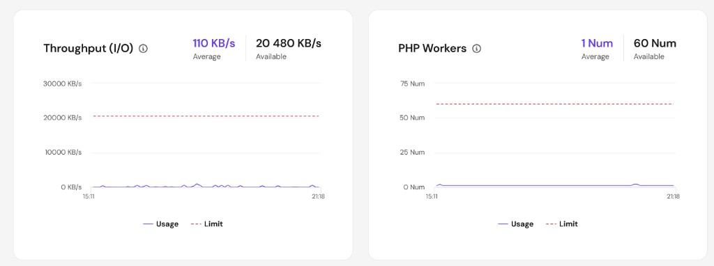

# MEXC Live Stats — backend

**FastAPI + PostgreSQL + Node SSR backend** for [logicencoder.com/mexc-app/](https://logicencoder.com/mexc-app/) and every **[/mexc/{SYMBOL}/](https://logicencoder.com/mexc/)** SEO page. The private service ingests MEXC spot trades over protobuf WebSockets, stores rolling history, computes 24h pair analytics, broadcasts live updates to browsers, and pushes finished snapshot payloads to WordPress. Traders see the dashboard through the plugin; this repo documents the server-side half of that product pair.

## Tech stack

| Layer | Technologies |
|-------|--------------|
| Ingest | Python 3, FastAPI, uvicorn, MEXC V3 protobuf WebSocket, async workers |
| Storage | PostgreSQL, batched async inserts, rolling-window retention |
| Realtime | WebSocket with MessagePack frames, subscription rooms per symbol |
| Analytics | SQL aggregates — 24h OHLC, volume splits, trade-size tiers, hourly buckets |
| SEO feed | JSON bundles for Node SSR, snapshot POST to WordPress REST ingest |
| SSR service | Node.js, Express, React server render for crawler HTML + JSON-LD |
| Ops | Operator dashboard streams, monitoring endpoints, symbol reload API |
| Hosting | Self-hosted Linux server for compute; WordPress on shared hosting for public pages |

## Shared hosting, heavy work on the server

The public site lives on **WordPress shared hosting** (Hostinger). That environment is ideal for pages, shortcodes, sitemaps, and cached HTML — not for subscribing to an entire USDT spot fleet and writing millions of trades. The backend exists so **all heavy work stays off PHP**: persistent exchange sockets, deduplication, PostgreSQL, stats recomputation, MessagePack fan-out, and snapshot generation run on a **self-hosted Linux server** I operate, then push compact results to WordPress.

This was a deliberate design and tuning exercise on low shared-hosting headroom. **More than 1,400 USDT spot pairs** stream through the MEXC pipeline in production; the same pattern powers **roughly 800 Gate.io pairs** on the Gate stats sibling. Realtime data still reaches browsers over WebSocket; REST and WordPress transients cover corporate networks that block WS. WordPress remains a **display, routing, and SEO layer** — not the database of record for ticks.

After iteratively offloading ingest, batching writes, and narrowing what PHP regenerates on each request, shared hosting resource graphs show large margins on CPU, memory, PHP workers, throughput, IOPS, and process limits while both fleets run — evidence the split worked.

Plugin overview: [mexc-live-stats-plugin-overview](https://github.com/logicencoder/mexc-live-stats-plugin-overview) covers the WordPress dashboard, Coin Manager, and visitor UI.

## Realtime trade ingest

The service maintains long-lived **MEXC spot WebSocket** connections using generated protobuf bindings. Each deal message is normalized (symbol, price, size, side, timestamp, trade id), queued, and inserted into PostgreSQL in batches so the hot path never blocks on disk fsync per tick. Symbol subscriptions are sharded across connections with exchange precision cached locally so UI formatting matches MEXC metadata without per-client REST calls.

Pair list reload is **operator-triggered** — intentional so production does not flap subscriptions during exchange maintenance. Stale trades fall out of the configured rolling window so queries and snapshot builds stay bounded.

## PostgreSQL analytics and REST

Trades land in a dedicated **`trades`** table. Background workers and scheduled refresh recompute per-symbol **24h open, high, low, volumes** in base asset and USDT, **buy/sell imbalance**, trade-count ratios, **VWAP**, volatility hints, **trade-size histograms** (small / medium / large tiers), largest print metadata, and **hourly buckets** for charts. These aggregates feed both the public stats API and snapshot generation — visitors query consistent numbers whether they load live WebSocket panels or SSR HTML.

REST endpoints expose bootstrap coin lists, per-symbol stats, supplemental trade history, dead-symbol diffs, orderbook snapshots, and operator monitoring JSON. The WordPress plugin proxies some admin calls; browsers hit the backend directly for live streams.

## WebSocket broadcast

Browser clients open a **MessagePack-compressed WebSocket** to receive trades and headline stats without polling. Subscription changes when a user switches pairs on a per-coin page or loads the fleet grid. An internal broadcast queue fans out normalized frames to every connected session; operator dashboards use separate dashboard sockets for throughput, latency, and log tailing without mixing admin noise into the public tape.

## Snapshot push to WordPress

On a schedule (and on demand), the backend assembles **snapshot payloads** — structured stats, Schema.org fields, optional chart images — and **POSTs** them to the WordPress plugin REST ingest route with an API key. WordPress writes static HTML under `/snapshots/` and updates transients so crawlers and social previews see full content even when JavaScript is disabled. The plugin never recomputes pair analytics in PHP; it stores and serves what the backend already validated.

## Node SSR for SEO pages

A companion **Express + React SSR** process renders **[/mexc/{SYMBOL}/](https://logicencoder.com/mexc/)** HTML for search engines: KPI strip, bot-activity section, 24h hourly table, JSON-LD `Dataset` block, and internal links. SSR fetches the same Python API bundles the live dashboard uses, so rankings reflect live fields rather than marketing copy. SSR and the snapshot pipeline are complementary — both improve discoverability from different entry paths.

## Operator surfaces

The backend exposes monitoring streams and metrics used by wp-admin **Monitor Dashboard** in the plugin: messages per second, download rate, reconnect counts, subscription health, PostgreSQL row totals, connected client counts, and structured boot logs (connect, auth, bulk subscribe). Operators diagnose “stale public site” without SSH — though the compute still runs on the self-hosted server, not on shared hosting.

## Not the trading bot

**[mexc_trading_app](https://github.com/logicencoder/mexc_trading_app-overview)** is a separate local trading console with order placement. This backend ingests **public spot trades only** for the Logic Encoder stats site.

Private code: [mexc-live-stats-backend](https://github.com/logicencoder/mexc-live-stats-backend)

Plugin overview: [mexc-live-stats-plugin-overview](https://github.com/logicencoder/mexc-live-stats-plugin-overview)

See [REPOS.md](REPOS.md).

---

**Made by [Logic Encoder](https://logicencoder.com)** · [GitHub](https://github.com/logicencoder) · [Contact](https://logicencoder.com/contact/)
