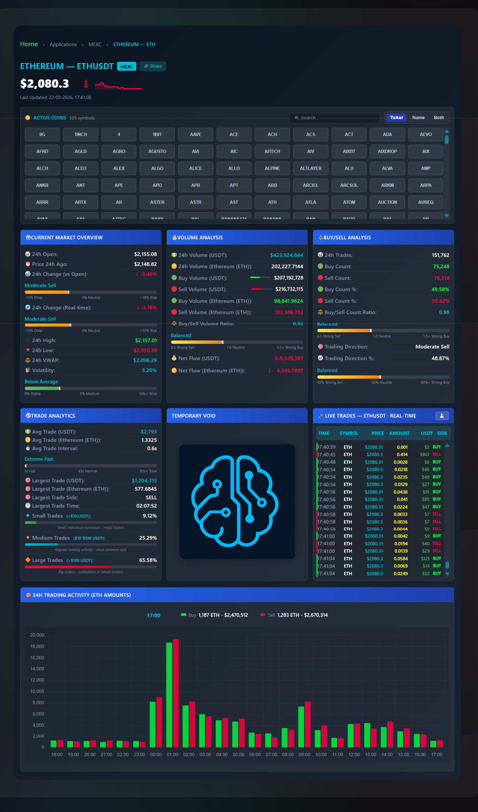

# MEXC Live Trading Statistics — Backend (Public Overview)

How the **private FastAPI backend** fits into the LogicEncoder MEXC product.  
No source code, API keys, or server hostnames in this repository.

**Live dashboard:** [logicencoder.com/mexc-app/](https://logicencoder.com/mexc-app/)  
**Private implementation:** [mexc-live-stats-backend](https://github.com/logicencoder/mexc-live-stats-backend) (access by invitation)



---

## Purpose

The backend answers two needs at once:

1. **Realtime operations** — ingest high-frequency spot trades from MEXC, aggregate 24-hour metrics for hundreds of USDT pairs, and stream updates to browsers with low latency.  
2. **Search discovery** — periodically build structured snapshot payloads (Schema.org JSON-LD, optional chart images) and push them to WordPress so crawlers see full HTML instead of an empty client shell.

---

## System position

```
MEXC exchange WebSocket
        │
        ▼
  FastAPI backend (this overview)
        │                    │
        │ REST / WS          │ POST snapshots
        ▼                    ▼
  Visitor browser      WordPress plugin
  (via plugin UI)      (static HTML + sitemap)
```

The WordPress plugin overview is [mexc-live-stats-plugin-overview](https://github.com/logicencoder/mexc-live-stats-plugin-overview).

---

## Realtime trade ingestion

### What

The server maintains persistent WebSocket connections to MEXC’s V3 API, decodes protobuf deal messages, normalizes each trade (symbol, price, size, side, timestamp), and stores rows in PostgreSQL. Subscribed browser clients receive trades over a dedicated WebSocket using compact MessagePack frames.

### Why it exists

Exchange websites are built for trading, not for watching **every** USDT market simultaneously. A dedicated ingest process can subscribe to many symbols in parallel, deduplicate by trade ID, and fan out only what the dashboard requested—without rate-limiting the public REST API on every tick.

### Who benefits

- **Visitors** see a live tape and rolling stats without installing software.  
- **Operators** get a single health surface (connection counts, queue depth, blocked symbols).  
- **The WordPress layer** stays stateless for trade data—it never becomes a database of millions of ticks.

### How it fits

Pair list reload is intentional and **manual** (admin/API trigger) so production does not flap subscriptions during API maintenance. Trades older than the configured window are purged to keep queries bounded.

---

## PostgreSQL persistence and analytics

### What

Each trade is inserted in batches (async queue + worker). Per symbol, SQL aggregates compute 24h open/high/low, volumes in base asset and USDT, buy/sell imbalance, trade-size histograms (small / medium / large in USDT), largest trade, hourly buckets for charts, and change percentages versus open and versus price 24h ago.

### Why it exists

In-memory-only analytics lose history on restart and cannot answer “what was volume in the 14:00 UTC hour?”. PostgreSQL gives durable history for the rolling window while keeping the hot path async.

### Who benefits

- **Researchers and power users** exporting or inspecting history via API.  
- **Snapshot generation** which needs consistent hourly series for chart PNGs.  
- **Operators** diagnosing gaps (empty symbol → no rows in window).

### How it fits

The plugin may call `GET /api/trades` for supplemental history; the primary live path is WebSocket. Stats refresh on a fixed interval (typically 10 seconds) aligned with broadcast cadence.

---

## WebSocket delivery (`/ws`)

### What

Clients connect (often through Cloudflare), optionally authenticate with an API key, subscribe to one or more symbols, and receive throttled trade messages. Global and per-symbol rate limits smooth bursts so 500+ symbols do not spike outbound bandwidth.

### Why it exists

HTTP polling would multiply load and add seconds of lag. MessagePack reduces bytes versus JSON; throttling prevents meltdown when many altcoins print trades in the same second.

### Who benefits

- **Dashboard users** watching multiple coins.  
- **Infrastructure** — predictable egress on the SOL host.

### How it fits

`AUTH_REQUIRED` and `REQUIRE_CLOUDFLARE` are production toggles documented in the private repo’s environment template—not repeated here.

---

## REST control plane

### What

Representative routes: `/api/stats`, `/api/symbols`, `/api/monitoring`, `/api/bootstrap/all`, `/api/trades`, `/api/reload-symbols`. A monitoring route exposes queue sizes, MEXC task health, and compression statistics.

### Why it exists

Browsers need bootstrap payloads; operators need reload and debug without SSH. Separating REST stats from WS trades keeps client logic simple.

### Who benefits

- **Plugin frontend** for initial grid population.  
- **Operators** verifying symbol subscription state after listing changes on MEXC.

### How it fits

Documented in full in the private `ARCHITECTURE.md`; this overview lists capability only.

---

## Dual SEO snapshots (generic + exchange-specific)

### What

On a timer (commonly 10–30 minutes depending on deployment file), the backend builds **two** HTML-oriented payloads per symbol:

| Type | Typical URL on site | Query intent |
|------|---------------------|--------------|
| Generic | `/snapshots/{slug}.html` | “Bitcoin price”, “XRP price today” |
| Exchange-specific | `/snapshots/mexc/{slug}.html` | “BTC price on MEXC”, branded long-tail |

Each payload includes Schema.org JSON-LD with descriptive property names (~185 fields) so parsers and LLM crawlers receive explicit semantics (volume, change %, trade counts, publisher, citation, timestamps).

Optional 24h volume chart PNGs are generated server-side and embedded as base64 in the JSON POST.

### Why it exists

JavaScript dashboards are poor SEO citizens. Pre-rendered HTML with structured data lets Google/Bing/AI crawlers index **current** numbers. Dual URLs separate generic asset queries from exchange-branded queries without duplicate content penalties when canonicals are set correctly.

### Who benefits

- **SEO visitors** landing on accurate static pages.  
- **LogicEncoder** — organic traffic for long-tail crypto price searches.  
- **AI crawlers** — machine-readable datasets with publisher attribution.

### How it fits

Payloads are `POST`ed to the plugin’s `/wp-json/mexc/v1/snapshot`. Upload rate limiting avoids overwhelming shared hosting.

---

## Chart image generation

### What

From hourly volume series, the backend renders a PNG (Pillow or matplotlib fallback), names it `{slug}-24h-trading-chart.png`, and sends it with the snapshot JSON.

### Why it exists

Rich results and social previews benefit from a real image URL; generating on the compute host avoids browser canvas differences.

### Who benefits

- **Search/social snippets** with chart thumbnails.  
- **Visitors** who open snapshot pages without running the live app.

### How it fits

Stored under `/snapshots/charts/` on WordPress; plugin overview describes public URLs.

---

## Operator dashboard variant

### What

An alternate server file adds `/dashboard` static UI, log streaming WebSockets, and runtime toggles (pause snapshots, force generation, adjust intervals).

### Why it exists

SSH-only debugging does not scale when hundreds of symbols fail subscription. A lightweight web dashboard surfaces logs and controls to authenticated operators.

### Who benefits

- **Maintainers** during incidents (WordPress 403, MEXC symbol blocks).  
- **Not** public visitors—the public product remains the WordPress page.

### How it fits

Same core ingest/DB code path; optional in production.

---

## Reliability patterns

### What

- Async connection pool to PostgreSQL with batched inserts.  
- Per-symbol broadcast workers and FIFO queues (no silent trade drops for subscribers).  
- Graceful shutdown hooks for WebSocket tasks and pool close.  
- CLI flags to disable snapshots or WordPress upload for staging.

### Why it exists

Spot feeds are noisy; shared hosting is fragile. Batching and backpressure protect both sides.

### Who benefits

- **Operators** running 500+ symbols on many-core SOL hardware.  
- **Hostinger** — snapshot POSTs spread over minutes, not one giant spike.

### How it fits

Detailed tuning constants live in private config classes—not published here.

---

## Tech stack (summary)

| Layer | Choices |
|-------|---------|
| API | FastAPI, Uvicorn, asyncio |
| Exchange | MEXC V3 WebSocket + protobuf |
| Database | PostgreSQL, asyncpg pool |
| Serialization | orjson, msgpack, aiohttp |
| SEO | Schema.org JSON-LD, optional PNG charts |
| Integration | WordPress REST snapshot endpoint |

---

## Who should read this repo

| Audience | Use it to… |
|----------|----------------|
| **Recruiters** | See realtime + data + SEO publishing in one backend ownership story |
| **System engineers** | Evaluate ingest → store → fan-out → publish boundaries |
| **Collaborators** | Know where to extend metrics or add exchanges (separate DB per exchange in code) |
| **Potential employers** | Evidence of production-minded async Python, not a tutorial bot |

---

## Security and disclosure

- Implementation, credentials, and SOL paths remain in the **private** repo.  
- This overview intentionally excludes API keys, database passwords, and internal IPs.  
- Production WebSocket access may require Cloudflare and API keys—configure on deploy, not in public docs.

---

## Related repositories

| Repo | Role |
|------|------|
| [mexc-live-stats-backend](https://github.com/logicencoder/mexc-live-stats-backend) | Private code |
| [mexc-live-stats-plugin-overview](https://github.com/logicencoder/mexc-live-stats-plugin-overview) | WordPress/public layer |
| [mexc-live-stats-plugin](https://github.com/logicencoder/mexc-live-stats-plugin) | Private plugin (linked for completeness; no code here) |

---

## Author note

Built for a real public dashboard: keep the hot path fast, push SEO work to scheduled snapshots, and document what each layer is for—not buzzwords.
